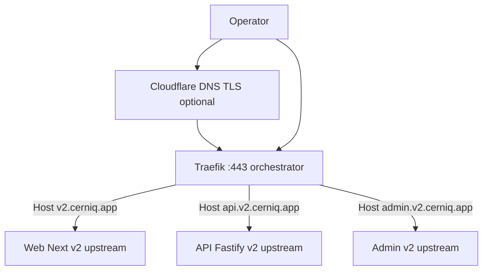
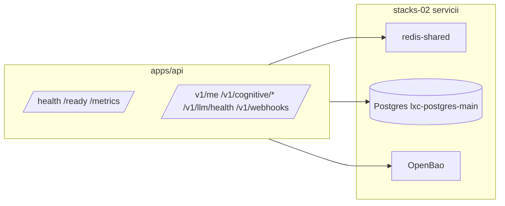
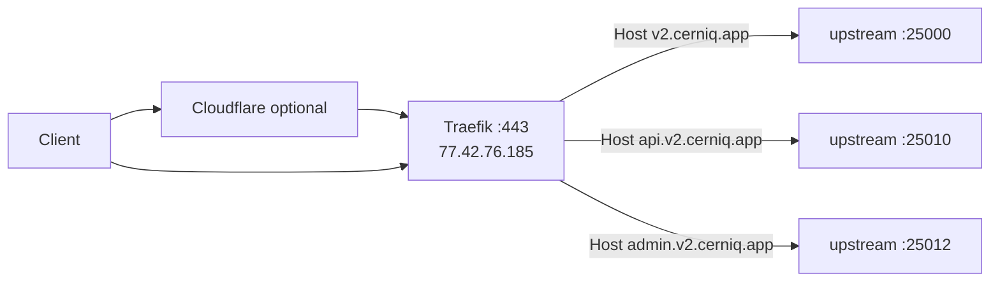

# C4 — L1–L3 și deployment Cerniq v2

**Sursă date rețea și host:** audit stacks-03 (infrastructură mașini/LXC), stacks-04 (topologie IP/firewall), stacks-05 (matrice porturi, HAProxy VIP), dată referință audit **2026-04-18**. **Nu** se adaugă IP, hostname sau port care nu apar în aceste reguli.

**Legături:** [network-stacks-04-mtu-vip.md](./network-stacks-04-mtu-vip.md), [haproxy-vip-path-stacks-05.md](./haproxy-vip-path-stacks-05.md), [port-matrix-v2-25xxx.md](./port-matrix-v2-25xxx.md) (plaja **25xxx** rezervată contractually pentru upstream Traefik v2; nu apare în audit ca serviciu deja alocat — vezi stacks-05 secțiunea J).

---

## L1 — Context (sistem)

Utilizatorii accesează aplicația peste HTTPS. Edge public: **Traefik** pe orchestrator (vezi L2). Opțional în față: **Cloudflare** (DNS/TLS); originea TLS la Traefik rămâne pe orchestrator conform stacks-02.

**Orchestrator (stacks-04 secțiunea A):** alias SSH `orchestrator`, IPv4 public **`77.42.76.185`**, vSwitch intern **`10.0.0.2`** pe `enp7s0`, rută `10.0.0.0/16` via `10.0.0.1`, **MTU vSwitch `1450`**. Traefik ascultă **`80`/`443`** pe host (stacks-05 A1).

---

## L2 — Containere și plasament fizic (audit stacks-03)

### Noduri relevante Cerniq

| Resursă | Rol | Date reale (stacks-03) |
|--------|-----|-------------------------|
| **Orchestrator** | Traefik, Redis shared expus, OpenBao, observability Docker | Mașina curentă de lucru; public `77.42.76.185`, vSwitch `10.0.0.2` (stacks-04 A) |
| **`hz.223`** | Proxmox; găzduiește LXC-uri Cerniq + CI worker | Public `95.217.32.223`, vSwitch primary `10.0.1.8` (stacks-04 B8) |
| **`lxc-prod-cerniq`** | Runtime PROD Cerniq (Docker pe CT) | **`10.0.1.109/24`**, gateway `10.0.1.7` (stacks-04 C6) |
| **`lxc-staging-cerniq`** | Runtime STAGING Cerniq | **`10.0.1.110/24`**, gateway `10.0.1.7` (stacks-04 C7) |
| **`lxc-postgres-main`** | PostgreSQL cluster principal | **`10.0.1.107/24`**, gateway `10.0.1.7` (stacks-04 C1; port **5432** stacks-05 H8) |
| **`hz.164`** | Dev (Cerniq dev + Neanelu dev) | Public `135.181.183.164`, vSwitch `10.0.1.6` (stacks-04 B6) |

**Redis shared (stacks-04 H punct 1, stacks-05 B1):** din orchestrator **`10.0.0.2:6379`**; VIP pe **`10.0.1.10:6379`** (HAProxy pe `hz.247`) → backend **`10.0.0.2:6379`**. Nu inventa alți endpoint-uri Redis pentru proiect — stacks-02.

**Înaintare din rețeaua vSwitch către orchestrator (stacks-04 B8):** pe **`hz.223`**, **`10.0.1.8:443` → DNAT `10.0.0.2:443`** (Traefik), **`10.0.1.8:8200` → DNAT `10.0.0.2:8200`** (OpenBao/Vault forward).

### Țintă procese monorepo (plaja 25xxx — plan / stacks-05 J)

| Proces | Rol | Bind țintă documentată |
|--------|-----|------------------------|
| `apps/web` | UI v2 Next | **`127.0.0.1:25000`** (sau serviciu pe rețeaua Traefik) |
| `apps/api` | API Fastify + SSE | **`127.0.0.1:25010`** |
| Admin UI | Admin v2 | **`127.0.0.1:25012`** |

Aceste porturi sunt **rezervare** pentru v2; serviciile **existente** pe LXC-uri Cerniq folosesc plaja **64xxx** pe containere (stacks-05 H4/H5) și VIP **19xxx** (staging) / **29xxx** (prod) prin HAProxy — vezi tabelul de mai jos.

### Mapare HAProxy VIP → Cerniq (stacks-05 B2, B3)

**Staging (`10.0.1.110`):** ex. VIP `19000` → `10.0.1.110:64000` (web), `19010` → `:64010` (API), `19012` → `:64012` (admin), plus exportere `19094`/`19095`/`19100` conform matricei B2.

**Producție (`10.0.1.109`):** ex. VIP `29000` → `10.0.1.109:64000`, `29010` → `:64010`, `29012` → `:64012`, plus `29094`/`29095`/`29100` conform B3.

### Dev `hz.164` (stacks-05 E — porturi reale pe host)

Exemple din audit: **`64000`** Cerniq Web dev, **`64010`** API dev, **`64012`** Admin dev, **`64080`** Monitoring API dev (mapare container în stacks-05 E).

---

## L3 — Componente software (API și pachete)

- **Fastify:** plugin-uri comune + rute sub `/v1/*`; health liveness `/health`, readiness `/ready`, metrics `/metrics`.
- **Monorepo:** `packages/neurons/*`, `packages/synapses/*`, `packages/gateways/*`, `packages/llm`, `packages/shared`, `packages/messaging` — conform structurii repo.

---

## Flux trafic v2 (Internet → aplicație)

**Variantă client din vSwitch:** acces la **VIP `10.0.1.10`** (pe `hz.247`) pentru **443** (Traefik) și **6379** (Redis), cu ACL-uri stricte documentate în stacks-04 B9; HAProxy backend **443 → `10.0.0.2:443`** (stacks-05 B1). Pentru servicii Cerniq expuse prin VIP pe plajele **19xxx/29xxx**, vezi [haproxy-vip-path-stacks-05.md](./haproxy-vip-path-stacks-05.md).

**MTU/MSS:** vSwitch MTU **`1450`**; pentru trafic selectat există reguli **TCP MSS clamping** (ex. la **1360**) pe calea către orchestrator — vezi [network-stacks-04-mtu-vip.md](./network-stacks-04-mtu-vip.md) și stacks-04 B9 (mangle).

---

## Dev și operare

- **Flux dev:** referință infrastructurală **`hz.164`** (stacks-03 secțiunea 5 + stacks-04 B6): rețele Docker `cerniq-dev_*` din audit; porturi publice dev în stacks-05 E.
- **CI:** worker **`lxc-ci-worker`** la **`10.0.1.108`**, resurse limitate memorie (stacks-03) — job-uri CI trebuie dimensionate accordingly.

---

**Dovadă reguli:** acest document nu înlocuiește fișierele canonice `.cursor/rules/stacks-0x-*.mdc`; menține consistență cu ele și cu `docs/compliance-stacks-01-05.md`.
