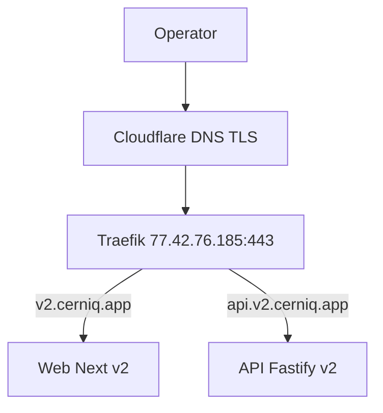
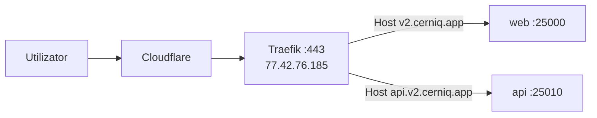

# C4 — L1–L3 și deployment Cerniq v2

Datele de rețea și host provin din audit stacks-03/04/05 (2026-04-18). Fără host/IP inventat.

## L1 — Context

## L2 — Containere (țintă deploy)

| Container / proces | Rol | Bind țintă |
|--------------------|-----|------------|
| `apps/web` Next standalone / Node | UI v2 | `127.0.0.1:25000` (sau rețea Traefik) |
| `apps/api` Fastify | API + SSE | `127.0.0.1:25010` |
| Admin UI (Next sau aceeași app) | Admin v2 | `127.0.0.1:25012` |
| redis-shared | Streams, BullMQ, rate limit | `10.0.0.2:6379` sau VIP `10.0.1.10:6379` |
| PostgreSQL | `lxc-postgres-main` | `10.0.1.107:5432` (via PgBouncer stacks-05) |
| OpenBao | Secrete | orchestrator `8200`/`8201` per stacks-05 |
| Vector / Tempo / Prometheus | Observabilitate | rețea `observability` orchestrator |

## L3 — Componente (API)

- Plugin-uri Fastify: health, sensible, rute versionate `/v1/*`.
- Pachete: `packages/neurons/*`, `packages/synapses/*`, `packages/gateways/*`, `packages/llm`, `packages/shared`.

## Flux trafic v2 (Internet → aplicație)

**Variantă VIP:** clienți din vSwitch care folosesc HAProxy pe `hz.247` cu VIP `10.0.1.10` → backend orchestrator `10.0.0.2:443` (Traefik) conform stacks-05 secțiunea L — vezi [haproxy-vip-path-stacks-05.md](./haproxy-vip-path-stacks-05.md).

## Dev

Referință stacks-03: `hz.164` (cerniq-dev) pentru flux de dezvoltare; conectivitate MTU vSwitch `1450` — vezi [network-stacks-04-mtu-vip.md](./network-stacks-04-mtu-vip.md).
