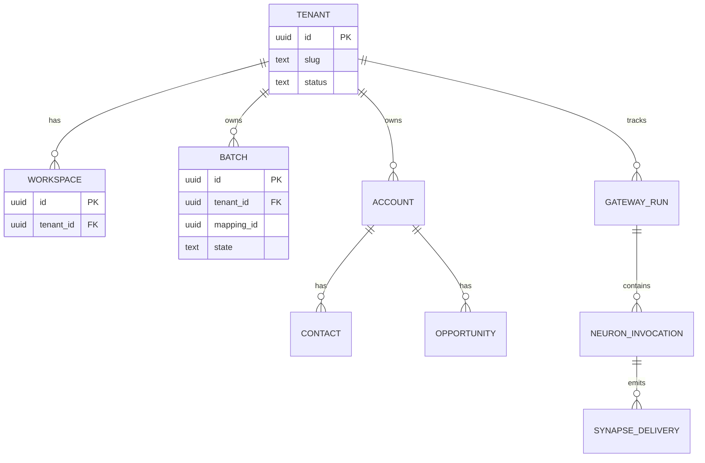

# Domeniu date — ERD țintă, migrații și manifeste

**Sursă infra DB:** stacks-05 secțiunea **H8** — container **`lxc-postgres-main`**, adresă **`10.0.1.107`**, port **`5432`**, serviciu **PostgreSQL 16** (text audit: „PostgreSQL 16”). **Nu** se folosesc alte IP-uri pentru „postgres principal” în documentație fără audit nou.

---

## Postgres central

| Parametru | Valoare (audit) |
|-----------|-----------------|
| Host LXC | `lxc-postgres-main` |
| IP | `10.0.1.107/24` (stacks-04 C1) |
| Port | `5432` (stacks-05 H8) |
| Conectare practică | PgBouncer / Traefik TCP / politică CMDB — fără a contrazice stacks-02 |

### Extensii: `pgvector`

- **Nu** se presupune activarea **`vector`** pe instanță.
- **Condiție de activare (stacks-01):** rulare verificare live pe instanța aprobată, ex.  
  `SELECT extname, extversion FROM pg_extension WHERE extname = 'vector';`  
  Dacă lipsește, crearea extensiei și migrațiile dependente intră sub control DBA + ADR, nu „implicit în cod”.

---

## Scheme țintă

| Schema | Rol |
|--------|-----|
| `brain_core` | Neuroni, gateway, topologie, artefacte execuție |
| `brain_audit` | Evenimente audit append-only |
| `auth` | IAM proiect (ex. `auth.users` — vezi migrații) |
| `business` | Domeniu CRM/ops tenant-scoped |

Comentarii pe scheme în migrația inițială: `V20260419000000__init_brain_business_placeholder.sql`.

---

## ERD țintă (Mermaid — model conceptual)

Tabelele de detaliu business (câmpuri CRM complete) se rafinează în migrații ulterioare; acest diagramă fixează **granulele** și FK-uri logice.

---

## Migrații — naming și fișiere existente

- **Director canonic:** `packages/db-migrations/sql/`.
- **Convenție fișier:** `V{timestamp}__{nume_descriptive}.sql` (Flyway-style).
- **Fișiere în repo (dovadă):**
  - `V20260419000000__init_brain_business_placeholder.sql` — creează scheme `brain_core`, `brain_audit`, `auth`, `business`.
  - `V20260419120000__auth_identity_placeholder.sql` — tabel **`auth.users`** (`id`, `tenant_id`, `email`, `password_hash`, timestamps, unic `(tenant_id, email)`).
  - `V20260419130000__brain_audit_event.sql` — tabel **`brain_audit.event`** (append-only, index pe `trace_id`).

**Regulă stacks-01/02:** rulare numai pe Postgres central aprobat; nu „migrații locale” împotriva unui container Postgres dedicat proiectului fără ADR.

---

## Dicționar — câmpuri transversale

| Câmp | Tip recomandat | Notă |
|------|----------------|------|
| `tenant_id` | `uuid` | Obligatoriu pe rânduri `business` și pe `auth.users` |
| `trace_id` | `text` | Corelare OTel / SSE |
| `created_at` | `timestamptz` | UTC |
| `idempotency_key` | `text` | Unic per tenant + domeniu funcțional unde e cazul |

---

## Mapare manifeste NEURON / SYNAPSE

| Fișier | Coloane (header CSV) | Rol |
|--------|----------------------|-----|
| `packages/manifests/NEURON_MATRIX.csv` | `id`, `name`, `description`, `package_suffix` | Cartografiere neuroni → pachete `packages/neurons/*` |
| `packages/manifests/SYNAPSE_MATRIX.csv` | `id`, `name`, `stream_key`, `consumer_group`, `package_suffix` | Cartografiere sinapse → stream Redis / consumer group / pachet |

Câmpurile `neuron_id` / capabilități din manifeste se aliniază la RBAC și la entități `brain_core` în generatoare și în ADR-uri de domeniu.

---

## Verificare

- **Gate doc + contract:** `tools/ci/gates/enterprise_docs_gate.py` (secțiuni obligatorii în acest fișier).
- **Conformitate:** `docs/compliance-stacks-01-05.md` (rânduri S02-D, S05-A).

---

**Dovadă reguli:** stacks-01 (zero presupuneri pe versiune extensii), stacks-02 (Postgres central), stacks-05 **H8** (port și engine).
