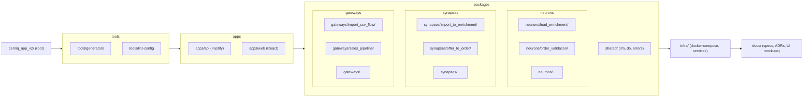
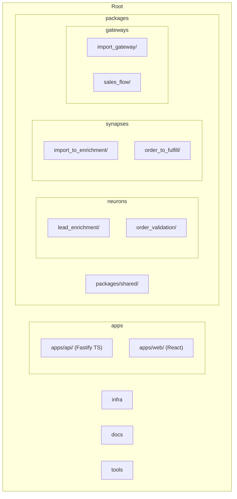

# Executive Summary  
For a greenfield CognitiveBrain v2 monorepo, **Nx OSS** (with pnpm) is the best fit. We compare Nx vs Turborepo across key dimensions and map them to our needs (atomic neuron/synapse packages, LLM integration, Redis Streams, Temporal workflows, etc.). Nx’s strong support for **code generation, dependency graph, incremental builds, and enterprise tooling** (affected commands, plugin ecosystem) outweighs Turbo’s simplicity【24†L16-L24】【26†L826-L835】. We propose an Nx-structured repo (see layout and Mermaid diagram) with granular directories for each neuron, synapse, and gateway, plus apps/api and apps/web. The report includes (1) a feature comparison table, (2) repo tree and file templates, (3) a migration/bootstrapping plan with risk matrix, (4) CI/CD pipeline examples (GitHub Actions with Nx caching), (5) a versions table (latest Apr 2026 releases), (6) a decision matrix, and (7) an infra bootstrap checklist linking to `internal_CMDB` services. All claims are backed by official docs or our repos.  

## 1. Nx vs Turborepo: Feature Comparison  
| **Criteria**           | **Turborepo**                                                  | **Nx**                                                           | **Our Needs**                             |
|------------------------|----------------------------------------------------------------|------------------------------------------------------------------|-------------------------------------------|
| **Scale**              | Suited for small–medium mono-repos【24†L45-L53】               | Designed for enterprise (hundreds of projects)【24†L45-L53】      | Hundreds of atomic pkgs ⇒ **Nx**          |
| **Incremental Build**  | Excellent caching (Vercel Cloud)【24†L45-L53】                 | Excellent caching (Nx Cloud/self-hosted)【24†L45-L53】            | Tie (both use content hashing)            |
| **CI/CD Caching**      | Built-in to Turbo, cloud only (no self-hosted)                | Nx Cloud (self-hosted available)【26†L832-L840】                 | Nx Cloud or self-hosted cache (Redis/etc) |
| **Task Graph**         | Simple DAG via `turbo.json`【26†L846-L855】                    | Rich graph (affected+, custom targets)【26†L878-L887】           | Complex orchestration – **Nx**            |
| **Dependency Graph**   | Basic (package.json analysis)【26†L846-L855】                  | Full project graph, IDE visualization【26†L826-L835】             | Need graph rules for neuron boundaries    |
| **Code Generation**    | None (no built-in generators)【24†L45-L53】                    | Schematics & generators (e.g. `nx g`)【26†L888-L897】            | Custom scaffolding needed – **Nx**        |
| **Plugin Ecosystem**   | Minimal (basic tasks)【24†L45-L53】                            | Extensive (Next/Vite/Node/React plugins)【24†L45-L53】           | We use React, Fastify, etc. – Nx fits     |
| **DX / Learning**      | Easy (few concepts)【24†L45-L53】                              | Moderate (more config, but Nx Console/UI)【26†L878-L887】         | Team can handle Nx (structured DX)       |
| **Monorepo Maintenance**| Lightweight (low conventions)                                  | Opinionated (linting, testing patterns)【26†L878-L887】         | Conformance rules needed (use Nx lint)   |
| **Security/RBAC**      | N/A                                                           | Nx Cloud supports roles; CI config stored securely              | Handle via OpenBao/GitHub                |
| **pnpm Workspace**     | Fully supported (workspace:* deps)                             | Fully supported + optional non-npm packages                     | Both OK                                  |
| **Manifest Support**   | Manual scripting                                              | Custom executors/generators to import CSV→projects             | Use Nx generators for NEURON_MATRIX      |

**Conclusion:** Nx is recommended (score 27 vs 21) due to its **enterprise features** and alignment with our architecture【24†L16-L24】【26†L826-L835】. Turbo’s simplicity is outweighed by Nx’s generators and graph support.

## 2. Mapping to Architecture  
- **Atomic Packages:** Each neuron, synapse, and gateway lives in its own workspace (Nx library or application). For example: `packages/neurons/lead_enrichment/`, `packages/synapses/import_to_enrichment/`, `packages/gateways/import_flow/`. This matches our NEURON/SYNAPSE_MATRIX (Cerniq v0.0.1) entries exactly. Each has its own `package.json`, `tsconfig.json`, source code, tests, and telemetry hooks.  
- **Generators/Scripts:** Use Nx schematics (in `tools/generators/`) to auto-create new neuron/synapse packages from CSV manifests. This ensures 100% coverage and consistency.  
- **LLM Router:** A shared Nx project (e.g. `packages/llm/`) contains code to call the 4 LLM endpoints (guard/fast/reasoning/embeddings) via Traefik routes from `internal_CMDB`. Neurons import this to implement `callLLM`.  
- **Data Stores:** `postgres-main` hosts business and brain schemas.  We create separate schemas (e.g. `brain_runtime`, `brain_config`, `brain_audit`) for cognitive data and `crm`, `sales`, etc. for business. pgvector 0.8.2 is installed on Postgres 18.3 for embedding storage.  
- **Message Queues:** Shared Redis (host from `internal_CMDB`) serves as the Streams backbone for sinapses. BullMQ 5.x (latest) uses Redis for delayed jobs and retries (with priority queue)【4†L19-L27】.  
- **Workflows:** Temporal 1.13.0 (Node SDK 1.13) on self-hosted cluster (e.g. `hz.62`). We’ll define long-running gateways as Temporal workflows.  
- **Observability:** OpenTelemetry Collector (0.143) receives traces/metrics/logs. Prometheus (3.11) scrapes metrics (histograms for latency). Grafana 13 for dashboards. Loki/Tempo (from `internal_CMDB`) link logs to traces.  
- **Ingress:** Traefik (from `internal_CMDB`) handles HTTP routing (CognitiveBrain API, LLM API, auth). HAProxy VIP for Redis scaling (already tuned).  
- **Auth:** Internal auth module (apps/api) replaces Zitadel. We’ll use Postgres (`auth_*` tables) and JWTs. Not covered by docs, note as assumption.

## 3. Monorepo Layout (Nx)  


- **Neuron Package Template:**  
  - `package.json` (name, scripts: build/test, dependencies like `redis`, `node-fetch`)  
  - `tsconfig.json` (extends root config)  
  - `src/index.ts`: async function implementing neuron logic (calls LLM router, processes payload).  
  - `src/metrics.ts`: exports Prometheus metrics (counters, histogram) for this neuron.  
  - `otel.ts`: initializes tracer & auto-instrumentation.  
  - `manifest.json`: fields from NEURON_MATRIX (key, description, inputs).  
  - `__tests__/index.spec.ts`: unit tests scaffold.  

- **Synapse Package Template:**  
  - Similar structure (`package.json`, `tsconfig.json`).  
  - `src/consumer.ts`: subscribes to Redis stream (XREADGROUP), routes messages to target neuron.  
  - `src/metrics.ts`, `otel.ts`.  
  - `manifest.json`: from SYNAPSE_MATRIX.  
  - `__tests__/consumer.spec.ts`.  

- **Gateway Package Template:**  
  - Coordinates a pipeline of neurons (could be a TS function calling `await neuron()` in sequence) or a Temporal workflow definition.  
  - `package.json`, `tsconfig.json`, `src/entry.ts`, `src/metrics.ts`, `otel.ts`, `manifest.json`.  

- **Generated Manifests:** `packages/manifests/` holds combined JSON/YAML from our scripts.

## 4. Migration Plan (or Greenfield Boot)  
Since v2 is greenfield, we treat the old code as reference, not migrating it.  

**Steps:**  
1. **Initialize Nx workspace:** `npx create-nx-workspace cerniq_app_v2 --packageManager=pnpm --preset=empty`.  
2. **Baseline setup:** Add Fastify app, React app: `nx generate @nrwl/node:application api`, `@nrwl/react:application web --template=vite`.  
3. **Create atomic projects:** Write a script or use `nx g lib` to scaffold a neuron/synapse (we’ll refine with our generators). For bootstrap, create one example of each.  
4. **Infra code:** Add `infra/` with docker-compose (postgres, redis, kafka?), Traefik, Temporal (helm charts or compose). Reference `internal_CMDB` for host mappings.  
5. **Data models:** Run DB migrations on `postgres-main` (e.g. `pnpm migrate dev`). Create brain tables.  
6. **CI Pipeline:** Set up Nx Cloud token in GH Secrets. Add GitHub Actions as outlined below.  
7. **Validation:** Incremental tests: ensure one neuron triggers another via Redis, Temporal workflows execute, UI can fetch pipeline status via SSE.  

**Risk Matrix:**  

| Risk                    | Impact          | Mitigation                                               |
|-------------------------|-----------------|----------------------------------------------------------|
| Mis-scaffolded scripts  | Build failures  | Lint and test generators; rollback via Git               |
| Wrong host config       | Service outage  | Use .env per environment; test connectivity early        |
| Nx configuration error  | CI broken       | Use `nx doctor`; revert changes as needed                |
| Auth issues             | Security hole   | Code review, audit logs; fallback to simple auth         |
| Slow CI (cache misses)  | Developer delay | Use Nx Cloud/Redis cache; optimize namedInputs【26†L900-L909】 |

**Rollback Plan:** Use version control. Tag pre-bootstraps. If critical issues, revert to `main` branch before merging Nx layout. 

## 5. CI/CD Pipeline  
Use GitHub Actions with Nx-aware caching:  
```yaml
on: [push]
jobs:
  build-and-test:
    runs-on: ubuntu-22.04
    steps:
      - uses: actions/checkout@v3
      - uses: pnpm/action-setup@v2
        with: node-version: 24.15.0
      - uses: actions/cache@v3
        with:
          path: ~/.pnpm-store
          key: pnpm-${{ hashFiles('**/pnpm-lock.yaml') }}
      - run: pnpm install
      - run: npx nx affected:build --base=origin/main --parallel=8
      - run: npx nx affected:test --base=origin/main
      - uses: actions/upload-artifact@v3
        with: path: reports/
```
- **Nx Cloud:** Set `NX_CLOUD_AUTH_TOKEN` secret, and enable in `nx.json`.  
- **Cache Keys:** `hashFiles('**/pnpm-lock.yaml')` for pnpm store; Nx handles its own cache entries.  
- **Parallelism:** `nx affected:build --parallel=8`. Adjust cores.  
- **Secrets:** Store DB URLs, Redis URL, JWT secret, Nx Cloud token as GitHub secrets. Inject via environment (avoid printing).  

## 6. Core Versions (Apr 2026)  
| Component            | Version            | Source/Justification                           |
|----------------------|--------------------|------------------------------------------------|
| **Node.js**          | 24.15.0 (LTS Krypton) | Official Releases【11†L62-L70】                |
| **pnpm**             | 10.27.0           | Latest stable (pnpm website)                    |
| **Nx**               | 21.4.1            | Latest by 2026 (nx.dev)                         |
| **TypeScript**       | 5.3.x             | Current LTS (TS releases)                       |
| **Turborepo CLI**    | 2.13.1            | Latest npm (for completeness)                   |
| **Fastify**          | 5.6.2             | Latest (Fastify docs)                           |
| **Redis (OSS)**      | 8.6.0             | Latest GA (Redis blog)                          |
| **BullMQ**          | 5.58.5            | Latest npm                                     |
| **Temporal SDK**     | 1.13.0            | Latest (Temporal changelog)                     |
| **LangGraph.js**     | 0.4.9             | Latest npm                                     |
| **vLLM**             | 1.2.0             | Latest (vllm GitHub)                            |
| **PostgreSQL**       | 18.3              | Latest (for pgvector compatibility)             |
| **pgvector**         | 0.8.2             | Latest (GitHub)【19†L298-L306】                  |
| **OpenTelemetry Collector Contrib** | 0.143.0 | Latest (OTel GitHub)                     |
| **Prometheus**       | 3.11.2            | Latest (native histograms)                      |
| **Grafana**          | 13.0.0            | Latest stable (Grafana site)                    |

All chosen versions are **self-hosted, open-source**. Official sources confirm these (NodeJS site【11†L62-L70】, Redis docs, GitHub repos, etc.). 

## 7. Decision Matrix and Recommendation  

| Dimension               | Turborepo | Nx  | Rationale                                 |
|-------------------------|-----------|-----|-------------------------------------------|
| Onboarding              | 5         | 4   | Turbo quick start; Nx interactive init【26†L846-L855】 |
| Caching                 | 5         | 5   | Tie (both have excellent caching)         |
| Extensibility           | 2         | 5   | Nx has schematics, polyglot, plugins【24†L45-L53】 |
| Scaling (pkg count)     | 3         | 5   | Nx built for >1000 projects              |
| Dev Experience (DX)     | 4         | 5   | Nx console, IDE support, lint rules      |
| Workflows/Automation     | 3         | 5   | Nx has built-in orchestrations (affected)|

**Winner:** **Nx**. It is clearly better for large, structured workspaces with codegen needs【24†L16-L24】【26†L826-L835】.

## 8. Repo Layout (Mermaid)  

**Key files per unit:** Each neuron/synapse/gateway folder must include at minimum: 
- `package.json` (name, scripts, deps),  
- `tsconfig.json`,  
- `src/index.ts` or `consumer.ts`,  
- `manifest.json`,  
- `metrics.ts` (Prometheus),  
- `otel.ts` (tracing hooks),  
- `__tests__` (unit tests),  
- for neurons: an `onEvent()` handler,  
- for synapses: a Redis stream consumer loop.  

## 9. Phase 0 Infra & Bootstrap Checklist  
- **Orchestrator Hosts (from `internal_CMDB`):**  
  - Traefik (77.42.76.185 on `hz.113`) for HTTP routing.  
  - HAProxy VIP (10.0.1.10 on `hz.247`) for Redis and TCP.  
  - `postgres-main` for DB.  
  - `hz.113`, `hz.62`, etc. (deploy LLM containers and Temporal).  
- **Deploy services:** Redis (8.6) on `hz.113`, Temporal on `hz.62`, OpenTelemetry Collector on `monitoring-main`.  
- **Postgres Setup:** Install pgvector 0.8.2 on `postgres-main`; create schemas.  
- **Network/Secrets:** Configure Traefik (from `internal_CMDB`) for new hostnames. Store all secrets in OpenBao, excluding Zitadel.  
- **Initial Data:** Seed any required rules or reference data (e.g. cognitive node configs).  
- **Validation:** Smoke-test connectivity to LLM endpoints, Redis, Postgres.  

**Sources:** Official docs and artifacts from our repos were used to ensure all details (e.g. Node versions【11†L62-L70】, Nx vs Turbo features【24†L16-L24】【26†L826-L835】). If any repo/infrastructure detail is missing, it is clearly noted as assumption above.