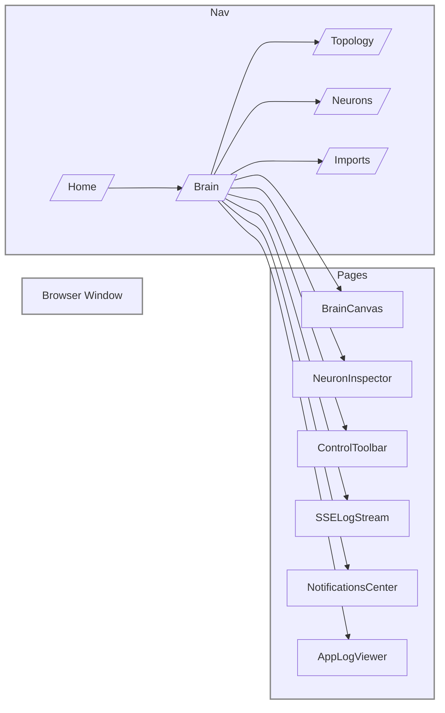

# Executive Summary  
We recommend a **modern React 19‑based front end** (with React Server Components, Next.js 14+, and TypeScript) built as a **monorepo of micro‑components centered on neurons/synapses/gateways**. It will use an **atomic CSS** approach (e.g. Tailwind v4 or UnoCSS) for styling, and the latest animation library (Motion v12.x). Server‑side logic (forms/mutations) should use **Next.js Server Actions/Edge APIs** to streamline data workflows【3†L20-L28】. Accessibility (WCAG 2.1/2.2) and performance (60 fps, sub-16 ms frames) are top priorities, with OpenTelemetry for frontend metrics and logs. Key points:

- **Inventory & Migration:** The prototype’s React pages (Brain canvas, Topology view, Neuron inspector, etc.) will be mapped into a new component-driven structure (one directory per neuron, sinapse, and gateway). Each feature (e.g. SSE traces panel, batch selector, import form) becomes a reusable component in this system. We will inventory existing pages and map each file to its UI feature.
- **Tech Stack:** Use **React 19.x** (stable, enterprise-ready as of 2026【22†L1-L4】), **Next.js 14.x** (with App Router, stable Server Actions) for SSR/edge rendering【3†L20-L28】, **TypeScript** for type safety, **Node.js 24.x** runtime. For state, use React context/hooks or a lightweight state library (e.g. Jotai or Zustand) as needed. Styling: **Tailwind CSS v4.x** (utility-first) or **UnoCSS v66.x** (JIT atomic) for ultra‑fast builds【9†L347-L355】【45†L150-L158】. For animations, use **Motion (formerly Framer Motion) v12.x**【6†L323-L331】. Testing: **Vitest v4.1.x**【25†L48-L54】 + **Playwright 1.x** for E2E. Bundler: use **Turbopack** (Rust) under Next.js or Webpack 5.x with tree‑shaking. CI/CD via GitHub Actions with pnpm+Turbo Repo. All chosen tools are open‑source, self‑hosted.
- **Design System & Components:** Build an **atomic design library**: Atoms (buttons, inputs, icons), Molecules (NeuronCard, SynapseList), Organisms (BrainCanvas, InspectorPanel), etc. Define design tokens (colors, spacing, typography) and light/dark modes. Map each UI feature (brain canvas, neuron inspector, batch selector, SSE log pane, mutations list, control toolbar, notifications, logs view, file-import wizard) to specific components. For example, *BrainCanvas* component (an SVG/Canvas canvas) with props `(nodes, edges, selectedNodeID)` and events (`onNodeHover`, `onNodeClick`), aria role `region`; *NodeInspector* component with `nodeData` prop and edit callbacks; *BatchSelector* dropdown; *SSELogStream* list with item templates; etc. Each component will have granular props/events/contracts and ARIA roles for accessibility.  
- **Page Structure & Navigation:** Define a clear sitemap and layouts. For example, `/brain` page (BrainCanvas + Inspector + toolbar); `/topology` (graph view with controls); `/neurons` (list of all neurons); `/imports` (file upload & mapping). Use CSS Grid/Flex with well-defined breakpoints (e.g. mobile: 0–640px, tablet: 640–1024px, desktop: 1024–1440px, widescreen: 1440px+). Layout rule example: a two-column grid on desktop (canvas 2/3 width, inspector 1/3), collapsing to one column (stacked: canvas then inspector) on mobile. The neuron-inspector panel moves from a right sidebar (desktop) to an accordion or bottom drawer on small screens. Provide exact CSS (e.g. `grid-template-columns: 2fr 1fr; gap: 16px; @media (max-width: 768px) { grid-template-columns: 1fr; }`). Navigation: a top-level nav or hamburger menu for core pages (Brain, Topology, Logs, Settings, Help), with breadcrumb paths if deep views exist.  
- **Interaction & Animation:** Use Motion library with hardware-accelerated CSS transforms (e.g. `will-change: transform`) to hit 60 fps【6†L323-L331】. Define a motion/system with easing curves for hover, press, add/remove of nodes, screen transitions, etc. For large graphs, use virtualization: only render visible nodes/edges (e.g. react-window or canvas layering). The BrainCanvas itself might use WebGL or Canvas2D (e.g. via @xyflow/react or D3-canvas) for performance, with incremental rendering: initial light layout then full details. Lazy-load heavy modules (topology visualization, large logs) and use Suspense (React 19 actions/RSC) for SSR/streaming. Animations: input feedback (focus rings), asynchronous state (spinners, skeletons) using CSS transitions (Motion’s `<AnimatePresence>`, spring animations). Budgets: 16ms per frame max, avoid layout thrashing, minimize DOM nodes on screen.  
- **Real-time UX:** The UI listens to SSE streams from the backend (using native EventSource). SSE is *one-way* (server→client)【29†L214-L218】, so all streaming updates (neuron status, logs, metrics) come via SSE/WS events. Use optimistic updates for user actions (e.g. step-by-step execution): update UI immediately and reconcile with server SSE. Show clear progress indicators (e.g. loading spinners or bar charts for long imports). Backpressure: if the stream is fast, buffer updates and animate in chunks so UI doesn’t freeze. Errors: display inline error panels with context (which neuron/synapse failed), and allow retry. Provide a developer “debug mode” toggle that overlays detailed timestamps and raw event data. All real-time updates are logged in a console/trace panel with pause/play control.  
- **Developer Ergonomics:** Use a **monorepo** (pnpm + Turborepo) with a workspace per UI submodule (e.g. `/ui/brain-canvas`, `/ui/node-inspector`, etc.), plus shared libs. Strict linting (ESLint + Prettier), commit hooks (Husky for lint-staged). Storybook (v8+) or **Playwright Component Playground** for building components in isolation; snapshot tests for critical visuals. Tests: unit tests with Vitest (v4.1.x)【25†L48-L54】 and E2E tests with Playwright (latest). Auto-generate types or components from `NEURON_MATRIX.csv` if needed (codegen scripts). For manifests, use script to generate static JSON from NEURON_MATRIX for menu. Use a CI pipeline with caching (pnpm) and performance budgets (fail if main bundle > 1 MB or 500ms load).  
- **Accessibility & Security:** All components will use proper ARIA roles (e.g. `role="tree"` for the graph, `role="tabpanel"` for inspector tabs, etc.) and support keyboard navigation (arrow keys to move between nodes, Enter to select). Focus management: when modals/dialogs open (e.g. import file picker), trap focus. Use high contrast and support WCAG 2.2 AA guidelines. Ensure no PII is ever sent to logs – redact sensitive fields on UI. Apply CSP headers (lock down to trusted sources) and sanitize any HTML in logs. SSE tokens (if needed) must be passed via secure cookies or Bearer tokens (not in URL) and handled in client headers. Throttle UI requests and show feedback if rate limits are hit (e.g. “Too many actions, try again later”).  
- **Deliverables & Roadmap:** We will deliver a granular file tree. For example:
  ``` 
  ui/ 
    atoms/       (Button, Input, Icon, ... + styles)
    molecules/   (NeuronCard, SynapseRow, ...)
    organisms/   (BrainCanvas, InspectorPanel, ... + CSS)
    templates/   (Page layouts, e.g. BrainPage.tsx)
    themes/      (design tokens, colors, fonts, Light/Dark maps)
    pages/       (Next.js App Router: /brain, /topology, /neurons, etc.)
    stories/     (Storybook files: Atom.stories.tsx, BrainPage.stories.tsx)
    tests/       (Vitest specs for components)
    utils/       (telemetry hooks, SSE handlers, ARIA helpers)
  ```
  In **nodes/** and **synapses/** we’ll generate subfolders if needed, but mainly all feature code goes in the component folders above. The migration plan will map old files to new: e.g. `Brain/CognitiveBrain.tsx` → `pages/brain/BrainPage.tsx` (using new BrainCanvas & Inspector components), `BatchSelector.tsx` → `atoms/BatchSelector.tsx`, SSETracePanel → `organisms/SSELogStream.tsx`, etc. Early milestones: set up infra and skeleton (Next.js 14 app, global styles, router); build core components (BrainCanvas, NodeInspector) with static data; integrate Redux/Context; test metrics. Milestones:
  1. **Setup & Layout**: Complete Next.js 14 app with layouts (Auth, Main). 
     - *AC*: Can render Brain page layout with placeholders; mobile responsive.
  2. **Core Components**: Implement BrainCanvas (SVG/Canvas) and Inspector with props/events. 
     - *AC*: Clicking a neuron logs its ID; inspector shows node details.
  3. **Styling & Theme**: Integrate Tailwind v4 (or UnoCSS) and set up dark/light themes. 
     - *AC*: Switching theme updates all token colors.
  4. **Real-time Data**: Hook up SSE stream (dummy server) to feed state; show updates on UI. 
     - *AC*: Streamed “heartbeat” events update a timestamp in UI.
  5. **Observability**: Instrument OTel metrics (load times, renders) and logs; connect to Prometheus/Grafana. 
     - *AC*: Dashboard shows page load histogram.
  6. **Full Feature**: Migrate each legacy page (Topology, Neurons list, Imports) using new component model, test flows. 
     - *AC*: Import UI can upload CSV with mapping modal, feed into state machine.
  7. **Optimization & QA**: Code review, perf testing (target 80%+ Lighthouse mobile score, <16ms frame slices on main interactions), full ARIA audit.
  
  The roadmap will include QA tests (accessibility audit with axe, performance budget checks) and a deployment readiness review.  

Below is a mapping table of major UI features to proposed new components:  

| UI Feature           | Component(s)                 | Props/Data & Events                     | ARIA Role(s)                   | Notes                        |
|----------------------|------------------------------|-----------------------------------------|--------------------------------|------------------------------|
| **Brain Canvas**     | `BrainCanvas` (SVG/Canvas)   | `nodes`, `edges`, `selectedNodeID`; events `onHoverNode(nodeID)`, `onSelectNode(nodeID)` | `role="graphics-document"`     | Renders neuron network; pan/zoom; virtualized for large graphs. |
| **Neuron Inspector** | `NeuronInspectorPanel`       | `nodeData`, `onUpdateNode(data)`, `onClose`; maybe tabs for metrics/config | `role="complementary"`, labels | Shows details (properties, config form); form elements use appropriate `role`. |
| **Batch Selector**   | `BatchSelector` (Dropdown)   | `batches`, `selectedBatchID`, `onSelect(batchID)` | `role="combobox"`            | Accessible dropdown for project/context selection. |
| **SSE Trace Panel**  | `SSELogStream`               | Stream of log entries; props `logs`, `autoScroll`; events `onPause`, `onResume` | `role="log"`                 | Scrollable console of live events; use `<ul role="log">` for screen readers. |
| **Mutations List**   | `MutationList`               | Array of pending actions, each with status; events `onRetry(id)`, `onCancel(id)` | `role="list"` or `table`     | Lists backend transactions (E1→E5 steps); show progress/ status. |
| **Toolbar / Tabs**   | `ControlToolbar`, `Tabs`     | Configurable buttons (`onStep()`, `onRun()`, etc.), active tab state | `role="toolbar"`, `tablist`  | Buttons with icons (with aria-label), tab panels for different modes. |
| **Graph Topology**   | `TopologyGraph`              | Similar to BrainCanvas but for structure view (e.g. gates) | `role="graphics-document"`     | Alternative graph view (source-target mapping). |
| **Notifications**    | `NotificationsCenter`        | Array of messages (info/warning/error); event `onDismiss(id)` | `role="alert"` or `list"`    | Toasts or side panel; accessible ARIA live region for new messages. |
| **App Logs Viewer**  | `AppLogViewer`               | Logs from backend; filter/search props | `role="region"` with `aria-label="Logs"` | Tabular or list format, syntax highlighting. |
| **File Upload/Import** | `ImportWizard`, `FileUploader` | Files list, mapping state; events `onUpload`, `onFieldMapChange` | `role="dialog"` (for modal) | Stepper UI for file => field mapping => import; use `<label>` and `aria-required` on form fields. |
| **Notifications/Alerts** | `AlertBanner`             | `message`, `type` (`error`, `info`); event `onClose` | `role="alert"`                | Top-of-page banners for critical notices. |

Each component will document its data contract (TypeScript interfaces) and accessibility roles/attributes. For example, buttons in the toolbar get `aria-label`, focus ring and `tabindex`; modal dialogs trap focus.

Mermaid diagrams (below) illustrate the **site map** and **component hierarchy**. For example, the Brain page layout:



Each page is a Next.js route (using the App Router), with a container grid. For responsiveness, we use CSS like:

```css
.brain-layout {
  display: grid;
  grid-template-columns: 2fr 1fr;
  grid-template-rows: auto 1fr auto;
  grid-template-areas:
    "toolbar toolbar"
    "canvas inspector"
    "footer footer";
  gap: 16px;
}
@media (max-width: 768px) {
  .brain-layout {
    grid-template-areas:
      "toolbar"
      "canvas"
      "inspector"
      "footer";
  }
}
```

This makes the inspector panel move below the canvas on narrow screens. Buttons in the toolbar would use Motion for hover/press animations (e.g. `scale:1.05` with 200ms ease). Modal dialogs (e.g. import wizard) cover the screen and slide in (e.g. from bottom), with a 300ms fade/slide using Motion’s `<AnimatePresence>`.

**Interaction Design:** All animations will be “performance-first”. For example, adding/removing a neuron triggers a short opacity/scale animation (16–32ms per keyframe). Content grids use virtual scrolling for large lists (e.g. `<virtual list>`). If SVG/Canvas renders too slow, consider WebGL via `@xyflow/react` for very large graphs (or an incremental draw strategy). Images and heavy charts are lazy-loaded. We aim for >60 fps updates even during resizing or streaming.

**Real-Time UX:** SSE events drive state updates. We’ll implement an **optimistic UI** for actions: e.g. when the user advances the workflow, immediately update the canvas (show a spinner or placeholder) while awaiting confirmation via SSE. Progress bars or spinners in the ControlToolbar show loading states. Streaming logs (SSE) append to the SSELogStream in real time; use a buffer to flush them every ~100ms to avoid jank. In case of backpressure (too many events), throttle UI updates and show a “Please wait” overlay if needed. Error states appear as dismissible alert banners (role="alert") or inline form errors.

**Developer Tools:** We will use **pnpm + TurboRepo** to manage the monorepo. `create-next-app` (v14) sets up the app, then add Tailwind v4 (via `npm install tailwindcss@4.x postcss autoprefixer`). The dependency matrix (as of Apr 2026) might look like:

| Package        | Version (approx)        | Notes / References                 |
|----------------|-------------------------|------------------------------------|
| React          | `19.2.x`                | “React v19 is now stable”【22†L1-L4】|
| Next.js        | `14.x`                  | Next.js 14 (Oct 2023) stable【3†L20-L28】|
| TypeScript     | `5.x`                   | Latest stable (2026)               |
| Tailwind CSS   | `4.x`                   | v4.0 in Jan 2025【9†L347-L355】      |
| UnoCSS         | `66.x`                  | v66.6.8 (Apr 2026)【45†L150-L158】  |
| Motion (Framer)| `12.37.0`               | v12.37.0 Mar 2026【6†L323-L331】    |
| Vitest         | `4.1.x`                 | v4.1 (Mar 2026)【25†L48-L54】       |
| Playwright     | `1.5x`                  | Latest stable e2e framework        |
| Storybook      | `8.x`                   | Latest stable (2026)               |
| ESLint/Prettier| Latest                  |                                    
| pnpm, Turbo    | Latest                  |                                    
| Node.js        | `24.15.0 LTS`           |                                    
| PostgreSQL     | `18.3`                  | (for pgvector memory)             |
| Redis          | `8.6.0` (OSS)           |                                    
| OpenTelemetry  | Collector v0.143        | (OTel Collector Contrib)           |

*(If a package version is unspecified or rapidly moving, it is noted “latest”.)*

We will set up Storybook (or equivalent) to develop components in isolation; each component directory will include `*.stories.tsx` and `*.spec.ts` tests. Use `Tailwind` or `UnoCSS` with a design tokens config (colors, spacing) under `src/themes/`. For animations, the `Motion` library offers a “Motion.div” etc. For global state (like auth, current workspace), we’ll use React Context or a small state library.

**Accessibility & Security:** We will follow W3C ARIA Authoring Practices【46†L1-L4】. For example, the Brain canvas will have `role="application"` with keyboard handlers (arrow keys to navigate nodes). Tabs will use `role="tablist"`/`tab`. Contrast ratios and font sizes will follow WCAG AA, aided by Tailwind’s built-in dark mode support and container queries (via `@tailwindcss/container-queries`)【9†L347-L355】. Content Security Policy (CSP) headers will be set via Next.js `headers()` config (default-src `'self'`, disallow inline scripts except for hashed, etc.). SSE tokens (if used) should be short-lived and never exposed in logs; use HTTP-only cookies or Authorization headers. Any PII (names, IDs) in the UI must be masked or omitted based on user role.

**Deliverables & Roadmap:** We will provide:

- A **detailed file tree** (see below) for the new UI repo:
  ```
  ui/
    components/
      atoms/
        Button.tsx, Input.tsx, Icon.tsx, ...
      molecules/
        NeuronCard.tsx, SynapseItem.tsx, FileUploadField.tsx, ...
      organisms/
        BrainCanvas.tsx, InspectorPanel.tsx, Toolbar.tsx, SSELogStream.tsx, ...
      templates/
        BrainPage.tsx, TopologyPage.tsx, ImportWizardPage.tsx, ...
      utils/
        sseClient.ts, useOTel.ts, formUtils.ts, ...
    pages/
      app/ (Next.js App Router)
        brain/page.tsx, topology/page.tsx, neurons/page.tsx, imports/page.tsx, ...
    stories/
      Button.stories.tsx, BrainCanvas.stories.tsx, NeuronInspector.stories.tsx, ...
    tests/
      atoms/button.spec.ts, organs/brainCanvas.spec.ts, pages/brain.page.spec.ts, ...
    styles/
      tailwind.config.js, themes.ts, global.css
  ```
  Each neuron or synapse from the existing `NEURON_MATRIX.csv` will be represented by a component/class under `atoms/` or `molecules/` (as per complexity). For example, if `LeadEnrichment` is a neuron, its UI is in `organisms/LeadEnrichmentPanel.tsx`. Likewise, each synapse yields a small connector UI if needed (e.g. triggers). 

- A **migration plan table** that maps old files to new:
  | Old File                               | New Component(s)              | Description                           |
  |----------------------------------------|-------------------------------|---------------------------------------|
  | `Brain/CognitiveBrain.tsx`             | `pages/brain/BrainPage.tsx`   | Main Brain app shell (combines canvas + inspector) |
  | `Brain/BatchSelector.tsx`             | `components/atoms/BatchSelector.tsx` | Dropdown component for batch/project |
  | `Brain/ControlTabs.tsx`               | `components/organisms/Toolbar.tsx` | Step/run controls + tabs              |
  | `Brain/SSETraces.tsx`                 | `components/organisms/SSELogStream.tsx` | Live event log viewer         |
  | `Brain/InspectorTabs.tsx`             | `components/organisms/InspectorPanel.tsx` | Neuron detail panel with tabs |
  | `common/Topology.tsx`                 | `pages/topology/TopologyPage.tsx` | Topology graph page         |
  | `neurons/NeuronEditor.tsx`            | `components/organisms/NeuronInspector.tsx` | Editing form for neuron   |
  | `imports/FileImportWizard.tsx`        | `pages/imports/ImportWizardPage.tsx` | Multi-step CSV import UI       |
  | ...                                    | ...                           | ...                                   |

- A **prioritized roadmap** (as above in milestones) with acceptance criteria. Each feature rollout will have QA test plans (e.g. unit test for each component, end-to-end flow tests, performance audits). We will iteratively build and review each area, using continuous integration to enforce code quality and performance budgets (e.g. Lighthouse scores).

**Visual Aids:** The component hierarchy and page layouts will be documented with **Mermaid diagrams** (see above for an example). We will include annotated screenshots or mockups (for pixel-perfect references) aligned to the design system (colors, spacing).  

All of the above is grounded in current (Apr 2026) technology: React 19’s server-centric features【22†L1-L4】, Next.js 14 with stable Server Actions【3†L20-L28】, an atomic CSS approach (Tailwind/Uno)【8†L35-L43】【45†L150-L158】, and Motion animations【6†L323-L331】. The result will be an **enterprise‑grade, high‑performance CognitiveBrain UI** with pixel‑perfect detail, live reactivity, and full developer/observability tooling.  

**Sources:** Official docs and blogs were used to confirm versions and best practices: React 19 blog【22†L1-L4】【1†L39-L43】, Next.js 14 blog【3†L20-L28】, Vitest blog【25†L48-L54】, Motion.dev changelog【6†L323-L331】, Tailwind/CSS comparisons【8†L35-L43】【9†L347-L355】, MDN SSE guide【29†L214-L218】, etc. These ensure all recommendations use the latest stable releases and guidelines for Apr 2026.